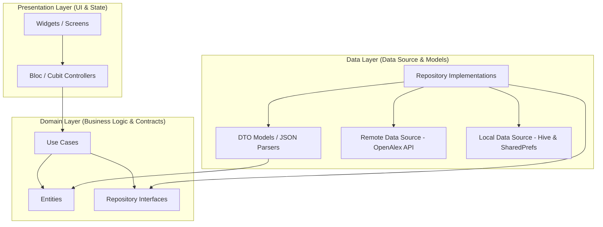
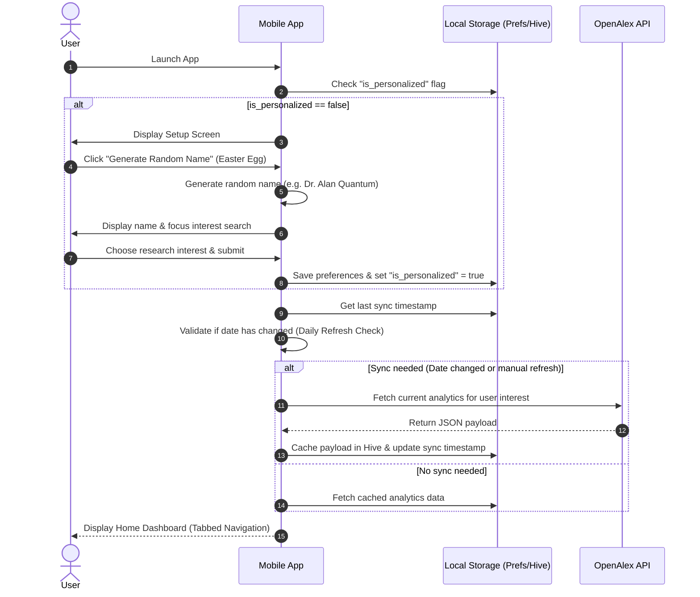

# **Journal Trend Analysis Mobile Application - Architectural Design Document**

This document details the complete, implementation-ready software architecture and system design for the Flutter-based **Journal Trend Analysis Mobile Application**. It follows clean architecture guidelines, utilizes standard state management, defines repository contracts, API integrations, caching mechanisms, user flow diagrams, and UI guidelines.

---

## **1. Requirements Analysis & Alignment**

Based on `requirements.md`, the system maps functional and non-functional requirements to the technical architecture as follows:

### **1.1 Functional Mapping**
- **Personalization Setup (4.9)**: Handled on application launch via a dedicated initialization guard. Includes a local configuration flag and a random name generator utility using academic title conventions.
- **Topic Search (4.1, 4.8)**: Utilizes the OpenAlex `/concepts` API endpoint to dynamically populate autocomplete dropdowns. Searches are cached in memory for the duration of the session.
- **Trend Analysis (4.3, 4.7)**: Maps to the **Keywords** and **Journal** tabs, using visual indicators and distinct chart engines to depict research trajectory over time.
- **Personalized Analytics (4.10)**: Filters the dashboard automatically based on the user's saved concept ID stored in local cache.
- **Daily Refresh (4.11)**: Runs a timestamp check during runtime initialization, updating stored data if local time has passed midnight (`00:00`).

### **1.2 Non-Functional Alignment**
- **Client-Side execution**: The application contains no custom backend services. It directly interfaces with the OpenAlex REST API with integrated rate limiting, exponential backoff, and local SQL/Hive databases for persistence.
- **Target Platform**: Optimized for Android (Min SDK 21, Target SDK 34) with responsive layout configurations.

---

## **2. System Architecture (Clean Architecture)**

The application utilizes **Clean Architecture** to segregate concerns into three distinct layers:



### **2.1 Layer Details**
1. **Presentation Layer**: Consists of Flutter widgets (UI) and `Bloc` / `Cubit` state managers. Widgets observe state changes and trigger events. No business logic or API parameters exist in this layer.
2. **Domain Layer**: The core of the application. Contains business entities, use case coordinators, and repository interfaces. It is purely written in Dart and has no dependencies on external packages, UI frameworks, or data sources.
3. **Data Layer**: Implements repository interfaces defined in the Domain layer. It coordinates remote (OpenAlex REST API via Dio) and local data sources (Hive / SharedPreferences). Converts incoming JSON into Data Transfer Objects (DTO Models) before mapping them to domain entities.

---

## **3. Folder Structure**

The project structure is organized by feature modules under `lib/features/` and global components under `lib/core/`.

```
lib/
├── main.dart
├── core/
│   ├── constants/
│   │   └── api_constants.dart
│   ├── error/
│   │   ├── exceptions.dart
│   │   └── failures.dart
│   ├── network/
│   │   ├── api_client.dart
│   │   └── network_info.dart
│   ├── theme/
│   │   ├── app_colors.dart
│   │   └── app_theme.dart
│   ├── usecases/
│   │   └── usecase.dart
│   ├── utils/
│   │   ├── name_generator.dart
│   │   └── date_formatter.dart
│   └── localization/
│       └── app_localizations.dart
├── features/
│   ├── personalization/
│   │   ├── domain/
│   │   │   ├── entities/
│   │   │   │   └── user_preferences.dart
│   │   │   ├── repositories/
│   │   │   │   └── user_repository.dart
│   │   │   └── usecases/
│   │   │       ├── get_user_preferences_usecase.dart
│   │   │       ├── save_user_preferences_usecase.dart
│   │   │       └── generate_random_name_usecase.dart
│   │   ├── data/
│   │   │   ├── models/
│   │   │   │   └── user_preferences_model.dart
│   │   │   └── datasources/
│   │   │       └── personalization_local_data_source.dart
│   │   └── presentation/
│   │       ├── blocs/
│   │       │   └── personalization_bloc.dart
│   │       └── screens/
│   │           └── setup_screen.dart
│   ├── home/
│   │   ├── domain/
│   │   │   └── usecases/
│   │   │       └── search_topics_usecase.dart
│   │   ├── data/
│   │   │   └── datasources/
│   │   │       └── search_local_data_source.dart
│   │   └── presentation/
│   │       ├── blocs/
│   │       │   ├── search_cubit/
│   │       │   └── dashboard_bloc/
│   │       └── screens/
│   │           └── home_screen.dart
│   ├── journal/
│   │   ├── domain/
│   │   │   └── usecases/
│   │   │       ├── get_publications_usecase.dart
│   │   │       ├── get_publication_details_usecase.dart
│   │   │       └── get_journal_ranking_usecase.dart
│   │   └── presentation/
│   │       └── screens/
│   │           ├── journal_screen.dart
│   │           └── publication_detail_screen.dart
│   ├── keywords/
│   │   ├── domain/
│   │   │   └── usecases/
│   │   │       ├── get_keyword_trends_usecase.dart
│   │   │       ├── get_top_authors_usecase.dart
│   │   │       ├── get_author_collaboration_usecase.dart
│   │   │       ├── get_emerging_keywords_usecase.dart
│   │   │       └── get_topic_evolution_usecase.dart
│   │   └── presentation/
│   │       └── screens/
│   │           └── keywords_screen.dart
│   ├── profile/
│   │   └── presentation/
│   │       └── screens/
│   │           ├── profile_screen.dart
│   │           └── settings_screen.dart
│   ├── author/
│   │   ├── domain/
│   │   │   └── usecases/
│   │   │       └── get_author_details_usecase.dart
│   │   └── presentation/
│   │       └── screens/
│   │           └── author_detail_screen.dart
│   └── institution/
│       ├── domain/
│       │   └── usecases/
│       │       └── get_institution_ranking_usecase.dart
│       └── presentation/
│           └── widgets/
│               └── institution_ranking_widget.dart
└── injection_container.dart
```

---

## **4. Technical & Cross-Cutting Strategies**

### **4.1 State Management Strategy**
The application uses the `flutter_bloc` library for state management. 
- **Blocs** (Event-to-State) are used for complex flows that handle distinct user interactions (e.g. `SearchBloc`, `PersonalizationBloc`, `DashboardBloc`).
- **Cubits** (Direct method execution) are used for simpler read-only states (e.g., `ThemeCubit`, `LanguageCubit`).
- All Blocs define distinct, immutable classes for:
  - **Events**: User actions (e.g., `SearchQueryChanged`, `SubmitPreferences`).
  - **States**: UI representation (e.g., `Initial`, `Loading`, `LoadSuccess`, `LoadFailure`).

### **4.2 Dependency Injection**
We utilize `get_it` coupled with `injectable` for Compile-Time Safe Dependency Injection. 
- Singletons are registered for foundational services (`DioClient`, `HiveDatabase`, `SharedPreferences`).
- Lazy Singletons are registered for data sources and repositories.
- Factories are registered for BLoc instances, ensuring a clean state lifecycle upon screen disposal.

### **4.3 Navigation Structure**
We use `go_router` to implement declarative navigation:
- **ShellRoute**: Sets up the persistent Bottom Navigation Bar containing the 4 main tabs (`Home`, `Journal`, `Keywords`, `Profile`).
- **First-time Guard**: A redirect check query verifies if user preferences exist in `SharedPreferences`. If absent, GoRouter automatically redirects to the `/setup` route.
- **Deep Linking**: Configured for publication details (`/journal/publication/:id`) and author details (`/keywords/author/:id`).

### **4.4 Error Handling Strategy**
- Returns error states using functional exceptions via the `dartz` library's `Either<Failure, T>` type.
- **Exceptions** are caught in the data sources and converted to **Failures** in the repositories.
- Custom failure models include:
  - `ServerFailure(String message)`: Catching 4xx/5xx API issues.
  - `CacheFailure(String message)`: Fetching database failures locally.
  - `NetworkFailure(String message)`: Displayed when offline without cache.

### **4.5 API Integration Strategy**
We consume data directly from the **OpenAlex REST API** via the `dio` network client.
- **User Agent Interceptor**: Attaches a custom header (e.g. `User-Agent: JournalTrendAnalyzer/1.0 (mailto:academic-analytics@fptu.edu.vn)`) to participate in OpenAlex's polite pool, ensuring fast responses and high rate limits.
- **Pagination**: Implemented via offset-limit mechanisms or cursor queries for lists.
- **Retries**: Integrated using exponential backoff inside an interceptor.

### **4.6 Offline Caching & Synchronization Strategy**
- **Settings Store**: `SharedPreferences` manages user credentials (Name, Selected Concept) and synchronization timestamps.
- **Data Caching**: `Hive` acts as a fast, key-value storage system.
- **Sync Logic**:
  ```
  App Start -> Fetch Last Sync Timestamp -> Date Changed?
                  ├── YES -> Fetch remote OpenAlex -> Cache local -> Render UI
                  └── NO  -> Load local Hive cache -> Render UI
  ```

### **4.7 Theme System**
Custom premium design aesthetics incorporating "Glassmorphism" design components, dark theme optimization, and responsive grids. 
- **Typography**: Google Fonts `Outfit` (Headings) and `Inter` (Body).
- **Core Theme System**: Supports Light and Dark modes with explicit semantic colors (detailed in Section 12).

### **4.8 Localization Strategy**
Supports English (`en`) and Vietnamese (`vi`) configured via `easy_localization`. Locale JSON strings are maintained under `assets/translations/`.

---

## **5. Application Modules & Sub-Features**

### **5.1 Authentication (Personalization Setup)**
- Gathers user name and research interests on first run.
- Integrates the "Easter Egg" random name generator using a structured combinatorial generator:
  - `[Title] [Academic Surname] [Modern/Tech Keyword]` (e.g. `Dr. Clara Quantum`, `Prof. Eric Neural`, `Dr. Sophia Vector`).
- Writes variables to Local DB, signaling router to transition to dashboard.

### **5.2 Dashboard (Home Tab)**
- Displays personalized welcome header, key statistics metrics card (Total papers, Average citations, Active years).
- Provides synchronization indicator showing "Last Updated" status and manual refresh trigger.
- Integrates topic search bar with recent search histories.

### **5.3 Publication Trend Module**
- Processes papers sorted by year, aggregating counts.
- Displays a Line Chart visualization featuring interactive tooltip highlights, custom labels, and gradient bounds under the line.

### **5.4 Citation Trend Module**
- Computes citation rates per year for the selected concept.
- Renders a multi-line or bar chart illustrating total citations vs average citation count per paper over time.

### **5.5 Top Keywords Module**
- Performs text tokenization or retrieves OpenAlex keyword values.
- Renders a Horizontal Bar Chart depicting the top 10 keywords by frequency count.

### **5.6 Emerging Keywords Module**
- Extracts keyword frequencies from the current year and compares them against the previous 3 years.
- Visualizes keywords exhibiting the highest growth rate as percentage indicators in a bento-grid card dashboard.

### **5.7 Topic Evolution Module**
- Visualizes the shift of top sub-concepts over a 5-year timeline. Shows how a parent concept branches into active subcategories.

### **5.8 Institution Ranking Module**
- Queries `/institutions` or groups publications by institution ID.
- Visualizes the top 10 contributing research institutions in a horizontal ranking bar chart.

### **5.9 Search Module**
- Handles dynamic lookup query validation.
- Provides immediate keyword matching against OpenAlex Concept API.
- Stores up to 10 recent searches locally.

### **5.10 Journal Detail Module**
- Opens when clicking a publication source.
- Details total publications, international rankings, h-index, and source homepage link.
- Visualizes journal ranking relative to others in the field.

### **5.11 Author Detail Module**
- Provides biographical info, total publication counts, and citation metrics.
- Visualizes the Author Productivity vs Impact Scatter Plot and Author Collaboration Network Graph.

### **5.12 Profile & Settings Modules**
- Edits personal metadata details (Name, Primary Research Concept).
- Customizes preferences (Language, Theme Mode, Sync Schedule, Local database wipe actions).

---

## **6. System Flow & Diagrams**

### **6.1 Screen Hierarchy**
```
MaterialApp (Theme & Localization)
 └── GoRouter
      ├── /setup (PersonalizationSetupScreen)
      └── / (MainShell - bottom navigation scaffold)
           ├── Tab 1: /home (HomeScreen / Dashboard)
           ├── Tab 2: /journal (JournalScreen / Publications List)
           │    └── Detail: /journal/publication/:id (PublicationDetailScreen)
           │         └── Source: /journal/detail/:jid (JournalDetailScreen)
           ├── Tab 3: /keywords (KeywordsScreen - Trends, Authors, Keywords)
           │    └── Detail: /keywords/author/:aid (AuthorDetailScreen)
           └── Tab 4: /profile (ProfileScreen / SettingsScreen)
```

### **6.2 User Flow Diagram**


### **6.3 Navigation Flow Diagram**
```mermaid
graph TD
    Start([Launch App]) --> PrefCheck{Preferences Exist?}
    PrefCheck -- No --> SetupScreen[Setup Screen]
    SetupScreen --> SavePrefs[Save Preferences to Prefs]
    SavePrefs --> DashboardRoute[/home - Dashboard Tab]
    PrefCheck -- Yes --> DashboardRoute
    
    DashboardRoute --> TabNav{User Selects Tab}
    TabNav --> |Tab 1: Home| DashboardRoute
    TabNav --> |Tab 2: Journal| JournalTab[/journal - Publications List]
    TabNav --> |Tab 3: Keywords| KeywordsTab[/keywords - Analytical Insights]
    TabNav --> |Tab 4: Profile| ProfileTab[/profile - Settings & About]
    
    JournalTab --> |Tap Paper| PaperDetail[/journal/publication/:id]
    PaperDetail --> |Tap Journal Name| JournalDetail[/journal/detail/:jid]
    KeywordsTab --> |Tap Author| AuthorDetail[/keywords/author/:aid]
```

### **6.4 Data Flow Diagram**

```mermaid
graph LR
    API[OpenAlex Remote API] -->|JSON Response| DTO[Data Transfer Objects / Models]
    DTO -->|Convert & Map| Cache[Hive Cache / SharedPreferences]
    Cache -->|Parse Entities| Repo[Repository Implementations]
    Repo -->|Return Either Failure, Entity| UseCase[Use Cases]
    UseCase -->|Deliver Entity| Bloc[Bloc State Managers]
    Bloc -->|Emit State| UI[Flutter Widgets / Screens]
    UI -->|Trigger Events| Bloc
```


---

## **7. Entities Definition**

These pure domain model objects are used across the presentation and domain layers.

### **7.1 Paper Entity**
```dart
import 'package:equatable/equatable.dart';

class Paper extends Equatable {
  final String id;
  final String title;
  final List<String> authors;
  final int publicationYear;
  final String journalName;
  final String journalId;
  final int citationCount;
  final String doi;
  final String abstractText;

  const Paper({
    required this.id,
    required this.title,
    required this.authors,
    required this.publicationYear,
    required this.journalName,
    required this.journalId,
    required this.citationCount,
    required this.doi,
    required this.abstractText,
  });

  @override
  List<Object?> get props => [
        id,
        title,
        authors,
        publicationYear,
        journalName,
        journalId,
        citationCount,
        doi,
        abstractText,
      ];
}
```

### **7.2 Journal Entity**
```dart
import 'package:equatable/equatable.dart';

class Journal extends Equatable {
  final String id;
  final String name;
  final int publicationCount;
  final int ranking;
  final int hIndex;
  final String homepageUrl;

  const Journal({
    required this.id,
    required this.name,
    required this.publicationCount,
    required this.ranking,
    required this.hIndex,
    required this.homepageUrl,
  });

  @override
  List<Object?> get props => [
        id,
        name,
        publicationCount,
        ranking,
        hIndex,
        homepageUrl,
      ];
}
```

### **7.3 Author Entity**
```dart
import 'package:equatable/equatable.dart';

class Author extends Equatable {
  final String id;
  final String name;
  final int publicationCount;
  final int citationCount;
  final int hIndex;
  final String institutionName;
  final String profileUrl;

  const Author({
    required this.id,
    required this.name,
    required this.publicationCount,
    required this.citationCount,
    required this.hIndex,
    required this.institutionName,
    required this.profileUrl,
  });

  @override
  List<Object?> get props => [
        id,
        name,
        publicationCount,
        citationCount,
        hIndex,
        institutionName,
        profileUrl,
      ];
}
```

### **7.4 Keyword Entity**
```dart
import 'package:equatable/equatable.dart';

class Keyword extends Equatable {
  final String name;
  final int count;
  final double growthRate;
  final double score;

  const Keyword({
    required this.name,
    required this.count,
    required this.growthRate,
    required this.score,
  });

  @override
  List<Object?> get props => [
        name,
        count,
        growthRate,
        score,
      ];
}
```

### **7.5 Institution Entity**
```dart
import 'package:equatable/equatable.dart';

class Institution extends Equatable {
  final String id;
  final String name;
  final String country;
  final int publicationCount;
  final int citationCount;

  const Institution({
    required this.id,
    required this.name,
    required this.country,
    required this.publicationCount,
    required this.citationCount,
  });

  @override
  List<Object?> get props => [
        id,
        name,
        country,
        publicationCount,
        citationCount,
      ];
}
```

### **7.6 PublicationTrend Entity**
```dart
import 'package:equatable/equatable.dart';

class PublicationTrend extends Equatable {
  final int year;
  final int count;

  const PublicationTrend({
    required this.year,
    required this.count,
  });

  @override
  List<Object?> get props => [
        year,
        count,
      ];
}
```

### **7.7 CitationTrend Entity**
```dart
import 'package:equatable/equatable.dart';

class CitationTrend extends Equatable {
  final int year;
  final int citationCount;

  const CitationTrend({
    required this.year,
    required this.citationCount,
  });

  @override
  List<Object?> get props => [
        year,
        citationCount,
      ];
}
```

### **7.8 UserPreferences Entity**
```dart
import 'package:equatable/equatable.dart';

class UserPreferences extends Equatable {
  final String fullName;
  final String interestConceptId;
  final String interestConceptName;

  const UserPreferences({
    required this.fullName,
    required this.interestConceptId,
    required this.interestConceptName,
  });

  @override
  List<Object?> get props => [
        fullName,
        interestConceptId,
        interestConceptName,
      ];
}
```

---

## **8. Repository Interfaces**

These interfaces define the domain repository contracts, mapping out all database and network tasks.

```dart
import 'package:dartz/dartz.dart';
import 'package:core/error/failures.dart';
import 'package:features/personalization/domain/entities/user_preferences.dart';
import 'entities/paper.dart';
import 'entities/journal.dart';
import 'entities/author.dart';
import 'entities/keyword.dart';
import 'entities/institution.dart';
import 'entities/publication_trend.dart';
import 'entities/citation_trend.dart';

abstract class UserRepository {
  Future<Either<Failure, UserPreferences>> getUserPreferences();
  Future<Either<Failure, void>> saveUserPreferences(UserPreferences preferences);
  Future<Either<Failure, String>> generateRandomResearcherName();
}

abstract class OpenAlexRepository {
  Future<Either<Failure, List<Map<String, String>>>> searchConcepts(String query);
  Future<Either<Failure, List<Paper>>> getPapersForTopic(String conceptId, {required int page, required int limit});
  Future<Either<Failure, Paper>> getPaperDetails(String paperId);
  Future<Either<Failure, List<PublicationTrend>>> getPublicationTrend(String conceptId);
  Future<Either<Failure, List<CitationTrend>>> getCitationTrend(String conceptId);
  Future<Either<Failure, List<Journal>>> getTopJournals(String conceptId);
  Future<Either<Failure, List<Author>>> getTopAuthors(String conceptId);
  Future<Either<Failure, List<Keyword>>> getTopKeywords(String conceptId);
  Future<Either<Failure, List<Keyword>>> getEmergingKeywords(String conceptId);
  Future<Either<Failure, List<Institution>>> getTopInstitutions(String conceptId);
  Future<Either<Failure, void>> refreshAllData(String conceptId);
}

abstract class SearchRepository {
  Future<Either<Failure, List<String>>> getRecentSearches();
  Future<Either<Failure, void>> saveSearchQuery(String query);
  Future<Either<Failure, void>> clearRecentSearches();
}
```

---

## **9. API Contracts (OpenAlex HTTP Schema)**

All requests use HTTP GET to the OpenAlex endpoints. 

### **9.1 Concept Dynamic Lookup**
- **Endpoint**: `https://api.openalex.org/concepts`
- **Query Params**:
  - `search`: `{query_string}`
  - `page`: `1`
  - `per_page`: `10`
- **Response Mapping**:
  ```json
  {
    "results": [
      {
        "id": "https://openalex.org/C41008148",
        "display_name": "Quantum mechanics",
        "level": 1
      }
    ]
  }
  ```

### **9.2 Publications Feed / Top Influential Papers**
- **Endpoint**: `https://api.openalex.org/works`
- **Query Params**:
  - `filter`: `concepts.id:{concept_id}`
  - `sort`: `cited_by_count:desc`
  - `page`: `{page_number}`
  - `per_page`: `20`
- **Response Mapping**:
  ```json
  {
    "results": [
      {
        "id": "https://openalex.org/W2112948259",
        "title": "Attention Is All You Need",
        "doi": "https://doi.org/10.48550/arxiv.1706.03762",
        "publication_year": 2017,
        "cited_by_count": 45120,
        "primary_location": {
          "source": {
            "id": "https://openalex.org/S4306400310",
            "display_name": "arXiv"
          }
        },
        "authorships": [
          {
            "author": {
              "id": "https://openalex.org/A5043818311",
              "display_name": "Ashish Vaswani"
            }
          }
        ]
      }
    ]
  }
  ```

### **9.3 Publication Trend Aggregation**
- **Endpoint**: `https://api.openalex.org/works`
- **Query Params**:
  - `filter`: `concepts.id:{concept_id}`
  - `group_by`: `publication_year`
- **Response Mapping**:
  ```json
  {
    "group_by": [
      {
        "key": "2023",
        "count": 1420
      },
      {
        "key": "2022",
        "count": 1180
      }
    ]
  }
  ```

---

## **10. Local Cache Architecture (Hive & SharedPreferences)**

To adhere to the daily automatic refresh requirement without backend storage, local boxes are configured using `Hive`.

### **10.1 User Settings Box (SharedPreferences Keys)**
- `KEY_FULL_NAME` (String): Stored user name or randomly generated researcher name.
- `KEY_CONCEPT_ID` (String): Selected OpenAlex concept ID.
- `KEY_CONCEPT_NAME` (String): Display name of the concept.
- `KEY_LAST_SYNC_DATE` (String): Timestamp string representing the last date an API sync was triggered (e.g. `2026-06-17`).

### **10.2 Hive Schema Definition**
We register adapters for caching the domain objects locally.

```
Box Name: "analytics_cache"
├─ Key: "trends_[concept_id]"       -> List<PublicationTrendModel>
├─ Key: "citations_[concept_id]"    -> List<CitationTrendModel>
├─ Key: "journals_[concept_id]"     -> List<JournalModel>
├─ Key: "authors_[concept_id]"      -> List<AuthorModel>
└─ Key: "keywords_[concept_id]"     -> List<KeywordModel>

Box Name: "search_history"
└─ Key: "recent_queries"            -> List<String>
```

- If database operations fail, a `CacheException` is thrown, converting to a `CacheFailure` returned by the Repository implementation layer.

---

## **11. Packages & Dependencies**

| Group | Dependency | Version (Range) | Rationale |
| :--- | :--- | :--- | :--- |
| **State Management** | `flutter_bloc` | `^8.1.3` | Clean separation of business logic and view components. |
| | `equatable` | `^2.0.5` | Value-based instance comparisons for UI states and Entities. |
| **Service Locator** | `get_it` | `^7.6.0` | Inversion of Control container for registration of features. |
| | `injectable` | `^2.3.2` | Code generator generating GetIt locator code automatically. |
| **Routing** | `go_router` | `^13.2.0` | Declarative page router with ShellRoute support for tabs. |
| **Network Client** | `dio` | `^5.4.0` | Robust network client supporting timeouts, logs, and interceptors. |
| **Local Cache** | `hive_flutter` | `^1.1.0` | Lightning-fast NoSQL database system optimized for mobile. |
| | `shared_preferences` | `^2.2.2` | Fast persistence of key-value user preference configurations. |
| **Functional Utils**| `dartz` | `^0.10.1` | Adds functional constructs (e.g., `Either`) for robust error handling.|
| **Visualizations** | `fl_chart` | `^0.66.0` | Rich canvas-driven charting engine supporting line and bar designs. |
| | `graphview` | `^1.2.0` | Specialized drawing library to render interactive Network Graphs. |
| **Localization** | `easy_localization`| `^3.0.3` | Clean localization resource loading and formatting functions. |

---

## **12. UI & Design System Guidelines**

The application enforces a premium academic design layout system incorporating Slate Dark styling presets, precise typeface hierarchies, and explicit bento-style card setups.

### **12.1 Color Palette**
The system uses the following curated dark color palette to deliver a luxury technical impression:

```
Background:         #0B0F19 (Deep Slate Black)
Surface Card:       #1E293B (Dark Blue-Grey Slate)
Primary Tint:       #6366F1 (Indigo Violet Accent)
Secondary Tint:     #10B981 (Emerald Green for Trends & Growth)
Highlight Tint:     #F43F5E (Rose for high citation counts)
Text Main:          #F8FAFC (Near White Slate)
Text Secondary:     #94A3B8 (Cool Slate Grey)
Border Line:        #334155 (Subtle Divider Line)
```

### **12.2 Spacing & Layout Constraints**
- All lists, grids, and dashboard views conform to a strict 8-point grid scale.
- Padding tokens: `xs: 4.0`, `sm: 8.0`, `md: 16.0`, `lg: 24.0`, `xl: 32.0`.
- Dashboard items should follow a **Bento Grid Layout** utilizing varying aspect ratios.

### **12.3 Font Scales**
- **Heading 1 (Hero Title)**: `Outfit`, size `28.0`, weight `FontWeight.w700`, line height `1.2`.
- **Heading 2 (Section Title)**: `Outfit`, size `20.0`, weight `FontWeight.w600`, line height `1.3`.
- **Subtitle (Card Header)**: `Outfit`, size `16.0`, weight `FontWeight.w600`, line height `1.4`.
- **Body Text**: `Inter`, size `14.0`, weight `FontWeight.w400`, line height `1.5`.
- **Caption / Meta Info**: `Inter`, size `12.0`, weight `FontWeight.w400`, line height `1.4`.

### **12.4 Micro-Animations & Visual Polish**
- **Page Transitions**: Custom ease-in transitions managed through `GoRouterPageBuilder`.
- **Chart Interactions**: Interactive tooltips displaying real-world dataset coordinates when tapped, utilizing a minor scale-up animation (`duration: 150ms`).
- **Shimmer Effects**: Custom gradient transition loading skeletons replacing standard loading circular spinners for dashboard panels.
