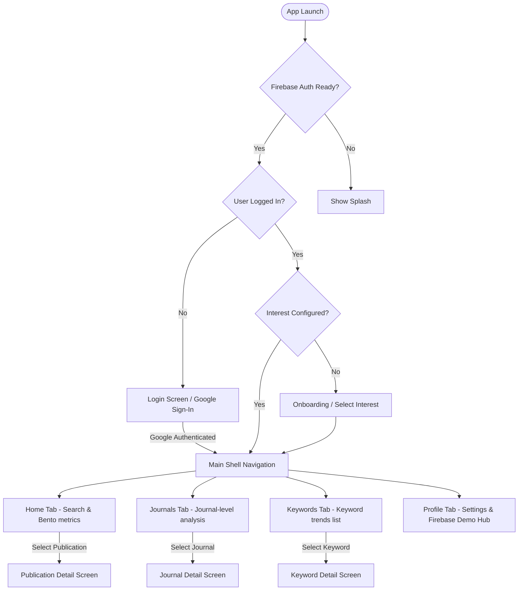
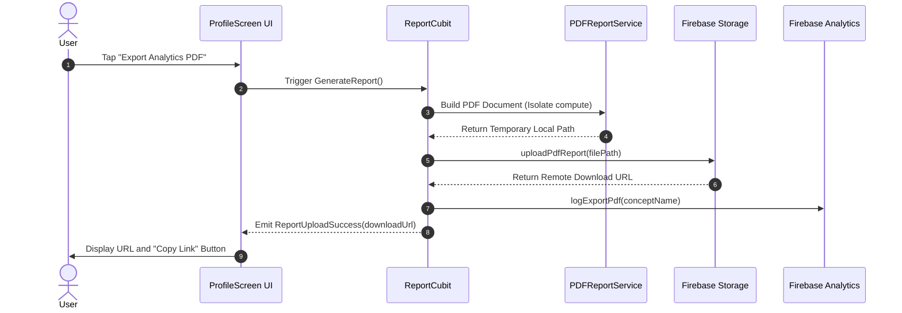
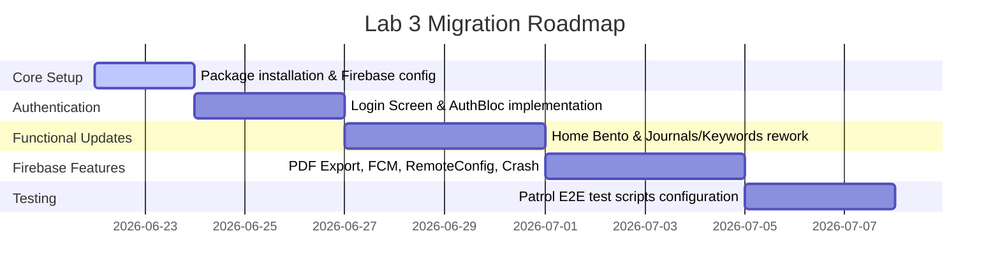

# **Architectural Design Update (Lab 3 Addendum) - design_change_request_01.md**

This document details the architectural modifications and additions required to support **Lab 3 (Firebase-Powered Journal Trend Analyzer)**. It acts as a direct delta overlay to the existing `design.md` architectural specification without redesigning unaffected modules.

---

## **1. New Components**

These components are introduced to integrate Firebase authentication, cloud storage, crash monitoring, push notifications, and automated reporting.

### **1.1 Firebase Services (Core Infrastructure)**
These services reside in `lib/core/firebase/` or `lib/features/shared/data/services/` and are registered as Singletons in the dependency injection container.

```
lib/core/firebase/
├── firebase_auth_service.dart
├── firebase_storage_service.dart
├── firebase_messaging_service.dart
├── firebase_remote_config_service.dart
├── firebase_analytics_service.dart
└── firebase_crashlytics_service.dart
```

1. **FirebaseAuthService**:
   - **Interface**:
     ```dart
     abstract class IFirebaseAuthService {
       Stream<User?> get authStateChanges;
       Future<UserCredential> signInWithGoogle();
       Future<void> signOut();
       User? get currentUser;
     }
     ```
   - **Role**: Coordinates Google Sign-In auth credentials and Firebase login handshakes.
2. **FirebaseStorageService**:
   - **Interface**:
     ```dart
     abstract class IFirebaseStorageService {
       Future<String> uploadPdfReport({required String filePath, required String destinationPath});
     }
     ```
   - **Role**: Handles binary streams uploading of generated PDF reports to Firebase Storage folders.
3. **FirebaseMessagingService**:
   - **Interface**:
     ```dart
     abstract class IFirebaseMessagingService {
       Future<void> initialize();
       Future<String?> getFcmToken();
       Stream<RemoteMessage> get onMessageReceived;
     }
     ```
   - **Role**: Sets up incoming notification channels, handles background notification callbacks, and fetches device registration tokens.
4. **FirebaseRemoteConfigService**:
   - **Interface**:
     ```dart
     abstract class IFirebaseRemoteConfigService {
       Future<void> initialize();
       int getInt(String key);
       String getString(String key);
       Future<bool> fetchAndActivate();
     }
     ```
   - **Role**: Synchronizes and queries configurations (e.g. `max_journals_limit`, `max_keywords_limit`).
5. **FirebaseAnalyticsService**:
   - **Interface**:
     ```dart
     abstract class IFirebaseAnalyticsService {
       Future<void> logLogin();
       Future<void> logSearchTopic(String keyword);
       Future<void> logViewPublication(String title, int year);
       Future<void> logViewJournal(String name);
       Future<void> logViewKeyword(String keyword);
       Future<void> logExportPdf(String topic);
       Future<void> logLogout();
     }
     ```
   - **Role**: Simple wrapper tracking user activities and pushing structured events.
6. **FirebaseCrashlyticsService**:
   - **Interface**:
     ```dart
     abstract class IFirebaseCrashlyticsService {
       Future<void> recordError(dynamic exception, StackTrace? stack);
       Future<void> forceCrash();
     }
     ```
   - **Role**: Intercepts unhandled app crashes and reports manually triggered debugging exceptions.

### **1.2 Report & Notification Modules (Domain & Data)**
1. **PDFReportService** (`lib/core/utils/pdf_report_service.dart`):
   - Compiles dashboard metrics into a formatted PDF using the `pdf` package. Writes output files temporarily to the application documents directory before storage upload.
2. **AuthBloc** (`lib/features/personalization/presentation/blocs/auth_bloc.dart`):
   - Coordinates login events (`SignInRequested`, `SignOutRequested`, `AuthCheckRequested`) and outputs states (`Unauthenticated`, `Authenticating`, `Authenticated`, `AuthError`).
3. **NotificationCubit** (`lib/features/profile/presentation/blocs/notification_cubit.dart`):
   - Local state manager displaying received notifications in the UI Notification Center.
4. **ReportCubit** (`lib/features/profile/presentation/blocs/report_cubit.dart`):
   - Manages PDF export operations: `GenerateReport`, `UploadReport`. Handles states: `ReportInitial`, `ReportGenerating`, `ReportUploading`, `ReportUploadSuccess`, `ReportFailure`.

### **1.3 New Screens**
1. **LoginScreen** (`lib/features/personalization/presentation/screens/login_screen.dart`):
   - Provides Google Sign-In triggers, branding visuals, loading overlays, and error dialogues.
2. **KeywordDetailScreen** (`lib/features/keywords/presentation/screens/keyword_detail_screen.dart`):
   - Shows keyword-focused analytics: publication trends chart (Line Chart), related journals list, related publications feed, top contributing authors (ranked list).

---

## **2. Modified Components**

These existing components require modifications to interface with the new Firebase modules.

### **2.1 Authentication & Configuration Guards (AppRouter)**
`lib/core/navigation/app_router.dart`:
- **Route Definitions**: Add `/login` route. Add `/keywords/detail/:kid` sub-route.
- **Redirection Logic**: Read user login state from `FirebaseAuthService` rather than local `SharedPreferences` variables:
  ```dart
  redirect: (context, state) {
    final authService = getIt<IFirebaseAuthService>();
    final isLoggedIn = authService.currentUser != null;
    final isGoingToLogin = state.matchedLocation == '/login';

    if (!isLoggedIn && !isGoingToLogin) {
      return '/login';
    }
    if (isLoggedIn && isGoingToLogin) {
      return '/home';
    }
    return null;
  }
  ```

### **2.2 UserPreferences Entity**
`lib/features/personalization/domain/entities/user_preferences.dart` & Model:
- **Extensions**: Add fields for profile metadata mapping (Google display name, email string, and profile picture URL).

```dart
class UserPreferences extends Equatable {
  final String fullName;
  final String email;
  final String photoUrl;
  final String interestConceptId;
  final String interestConceptName;
  // ...
}
```

### **2.3 ProfileScreen (Settings & Firebase Demo Hub)**
`lib/features/profile/presentation/screens/profile_screen.dart`:
- **Header Card**: Pulls authenticated user details (name, email, profile picture) from Firebase Auth.
- **Actions Panel**: Adds Sign Out button (clears local preferences, triggers firebase sign out, redirects to Login).
- **Notification Center Widget**: Binds list item updates to `NotificationCubit` local list.
- **Report Export Panel**: Binds trigger to `ReportCubit`. Displays dynamic loading states, success text, and select/copy URL button on completion.
- **Remote Config Preview Widget**: Displays the parsed Remote Config constraints (e.g. Max journals count).
- **Crashlytics Hooks**: Button components executing `getIt<FirebaseCrashlyticsService>().forceCrash()` and handled errors test blocks.

### **2.4 HomeScreen (Bento Metrics & Analytics)**
`lib/features/home/presentation/screens/home_screen.dart`:
- **Dashboard Metrics Layout**: Re-integrate and draw all 6 required dashboard metric widgets (Total publications, Average citations, Most active year, Top journal, Top author, and Most influential publication) in a balanced bento configuration.
- **Event Tracking**: Inject `FirebaseAnalyticsService` to trigger `logSearchTopic(query)` inside search text handlers.
- **Greeting Card**: Welcomes the user utilizing name strings from their Google account.

### **2.5 JournalsScreen & KeywordsScreen**
- **JournalsScreen** (`lib/features/journal/presentation/screens/journal_screen.dart`):
  - Completely re-orient screen layout from showing publications list to rendering **journal-level analysis**.
  - Displays: Top journals ranked by publication count (Horizontal Bar Chart), contribution charts, and citation statistics.
  - Tapping a journal navigates to `JournalDetailScreen`.
- **KeywordsScreen** (`lib/features/keywords/presentation/screens/keywords_screen.dart`):
  - Re-orient to show keyword frequency charts, trending keyword lists, and trend lines.
  - Tapping a keyword navigates to `KeywordDetailScreen`.

---

## **3. Updated Diagrams**

### **3.1 Navigation & Auth Guard Flow**


### **3.2 PDF Export & Upload Sequence**


---

## **4. Migration Strategy**

This migration path defines a progressive checklist to transition from the Lab 2 baseline to the updated Firebase + Patrol specifications.



### **Step 1: Package Dependencies Alignment**
Update `pubspec.yaml` to include Firebase, PDF generation, and Patrol test drivers:
```yaml
dependencies:
  # Firebase Core & services
  firebase_core: ^3.0.0
  firebase_auth: ^5.0.0
  google_sign_in: ^6.2.0
  firebase_storage: ^12.0.0
  firebase_messaging: ^15.0.0
  firebase_analytics: ^11.0.0
  firebase_crashlytics: ^4.0.0
  firebase_remote_config: ^5.0.0
  
  # PDF exporting
  pdf: ^3.10.8
  printing: ^5.11.0

dev_dependencies:
  # Patrol automation testing
  patrol: ^3.5.0
```

### **Step 2: Platform Provisioning (Android/iOS)**
1. Register Android package ID (`com.example.journal_trend_analysis`) on Firebase Console.
2. Generate SHA-1 and SHA-256 signatures for the development workspace:
   `keytool -list -v -keystore ~/.android/debug.keystore -alias androiddebugkey`
3. Download `google-services.json` and place it in the `android/app/` directory.
4. Update `android/app/build.gradle`:
   - Increase `minSdkVersion` to `23`.
   - Apply google-services plugin: `apply plugin: 'com.google.gms.google-services'`.
5. Update `android/build.gradle` classpath dependency configurations to support Firebase.

### **Step 3: Core Service Integrations**
1. Implement the mock/concrete wrappers for Firebase services.
2. Initialize Firebase asynchronously in `main.dart` before triggering App layout injection:
   ```dart
   WidgetsFlutterBinding.ensureInitialized();
   await Firebase.initializeApp();
   FlutterError.onError = FirebaseCrashlytics.instance.recordFlutterFatalError;
   ```
3. Update `injection_container.dart` (GetIt registrations) to register new BLocs, Cubits, and Firebase Services interfaces.

### **Step 4: Authentication & Router Guard**
1. Deploy `LoginScreen` and write `AuthBloc` states checking.
2. Update router redirection checks to secure shell routes from unauthenticated instances.

### **Step 5: View Rework & Layout Updates**
1. **Home Screen**: Expand metrics array display, update welcome banner binding.
2. **Journals / Keywords Screens**: Restructure tabs data models. Create the `KeywordDetailScreen`.
3. **Profile Screen**: Build notifications view, PDF storage upload buttons, Remote Config view, and Crashlytics action cards.

### **Step 6: E2E Automation Setup (Patrol)**
1. Initialize Patrol setup configurations on the development host.
2. Implement E2E scripts under `patrol_tests/` mapping all 11 required scenarios:
   - Perform layout widget targeting utilizing Patrol custom selector patterns (`$(ListTile).at(index)`).
   - Mock internal dependencies when verifying native interfaces (e.g. Google Sign-In) to avoid runtime emulator blocks during local testing.
